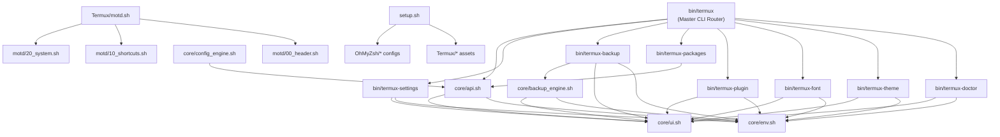

# Termux-Zsh v11.0.0 — Architecture Guide

This document details the internal architecture, module dependencies, engine flow, and extension points of the `Termux-zsh` framework.

---

## System Architecture Overview

```
Termux-zsh Framework v11.0.0
├── bin/                          # CLI Management Commands
│   ├── termux                    # Master CLI entrypoint & subcommand router
│   ├── termux-backup             # Timestamped backup, export/import engine
│   ├── termux-doctor             # 14-point diagnostic & health check runner
│   ├── termux-font               # Nerd Font switcher (12 fonts, v3.4.0)
│   ├── termux-packages           # Developer profile installer (11 stacks)
│   ├── termux-plugin             # Zsh custom plugin lifecycle manager
│   ├── termux-settings           # Interactive TUI dashboard menu (looping)
│   └── termux-theme              # Color scheme manager with ANSI previewer
├── core/                         # Developer API Engine
│   ├── api.sh                    # Logging, config key-value API, dependency checks
│   ├── backup_engine.sh          # Backup creation, restoration, & listing
│   ├── config_engine.sh          # Config file parser (~/.termux/termux-zsh.conf)
│   ├── env.sh                    # Environment exports, PATH, system detection
│   ├── module_loader.sh          # Extension module loader
│   └── ui.sh                     # Color codes, status badges, & UI card formatting
├── motd/                         # Dynamic Welcome Banner Modules
│   ├── 00_header.sh              # ASCII banner & version card
│   ├── 10_shortcuts.sh           # Master CLI command cheatsheet
│   └── 20_system.sh              # System metrics: RAM, Disk, Uptime, Battery
├── OhMyZsh/                      # Zsh Configuration & Plugins
│   ├── plugins/termux/_termux    # Zsh tab-completion (subcommands + sub-args)
│   ├── custom_aliases.zsh        # User aliases
│   ├── p10k.zsh                  # Powerlevel10k theme configuration
│   └── zshrc                     # Primary Zsh configuration file
├── Termux/                       # Terminal Assets & Properties
│   ├── colors/                   # Light & Dark color schemes (.properties)
│   ├── lang/                     # Localization strings (en, etc.)
│   ├── colors.sh                 # Terminal color scheme switcher
│   ├── font.ttf                  # Default JetBrains Mono Nerd Font
│   ├── fonts.sh                  # Nerd Font downloader & installer
│   ├── motd.sh                   # Modular MOTD runner engine
│   └── termux.properties         # Centered D-pad layout & allow-external-apps
├── .github/workflows/            # CI/CD Pipelines
│   ├── ci.yml                    # ShellCheck v0.11.0, Bash -n, & Zsh -n QA
│   └── release.yml               # Automated GitHub Release builder
├── docs/                         # Documentation Suite
│   ├── ARCHITECTURE.md           # This file
│   ├── COMMANDS.md               # CLI command reference manual
│   └── ROADMAP.md                # Version history & roadmap
├── setup.sh                      # Main installer script (supports -y non-interactive)
└── uninstall.sh                  # Restorer & uninstaller script
```

---

## Module Dependency Graph



---

## CLI Dispatch Flow

1. User invokes `termux <subcommand> [args]`
2. `bin/termux` sources `core/api.sh` (which chains `core/env.sh` → `core/ui.sh`)
3. `case` statement matches subcommand and `exec`s the appropriate handler binary
4. Each handler binary independently sources its required `core/` modules
5. Handler executes the requested action and outputs UI-formatted results

---

## Data Directories & File Locations

| Path | Purpose |
| :--- | :--- |
| `~/bin/termux*` | CLI tool symlinks (installed by `setup.sh`) |
| `~/.termux/` | Termux terminal config (colors, font, properties) |
| `~/.termux/motd/` | Installed MOTD module scripts |
| `~/.termux/motd.sh` | MOTD runner (symlinked to `$PREFIX/etc/motd.sh`) |
| `~/.termux/termux-zsh.conf` | Framework configuration key-value store |
| `~/.termux-zsh-backups/` | Timestamped configuration backups |
| `~/.oh-my-zsh/` | Oh My Zsh installation root |
| `~/.oh-my-zsh/custom/` | Custom plugins, themes, and aliases |
| `~/.zshrc` | Active Zsh configuration (installed by `setup.sh`) |
| `~/.p10k.zsh` | Powerlevel10k prompt configuration |
| `~/.config/lf/` | `lf` file manager configuration |

---

## Extension Points

### Adding a New CLI Subcommand
1. Create `bin/termux-<name>` with the standard header pattern:
   ```bash
   #!/usr/bin/env bash
   set -euo pipefail
   SCRIPT_DIR="$(cd "$(dirname "${BASH_SOURCE[0]}")/.." && pwd)"
   source "${SCRIPT_DIR}/core/env.sh"
   source "${SCRIPT_DIR}/core/ui.sh"
   ```
2. Add a `case` entry in `bin/termux` to dispatch to it
3. Add completion entry in `OhMyZsh/plugins/termux/_termux`

### Adding a New MOTD Module
1. Create `motd/<order>_<name>.sh` (e.g., `motd/30_weather.sh`)
2. It will be automatically sourced by `Termux/motd.sh` in alphabetical order

### Adding a New Color Scheme
1. Create `Termux/colors/<dark|light>/<name>.properties`
2. It will automatically appear in `termux theme list`

### Adding a New Package Profile
1. Add a new `case` entry in `bin/termux-packages` with the package list
2. Add a list entry in the `list_profiles()` function
